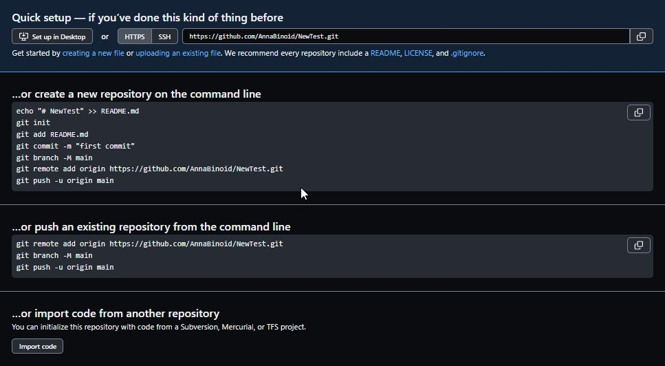

# Работа с Git

## 1. Проверка наличия установленного Git

В терминале выполнить команду **`git version`**

Если Git установлен, появится сообщение с версией программы, иначе будет сообщение об ошибке.

## 2. Установка Git

Загружаем последнюю версию Git с сайта https://git-scm.com/downloads
. Устанавливаем с настройками по умолчанию.

## 3. Настройка Git

При первом использовании Git необходимо представиться с помощью команд, которые необходимо ввести в терминал:
```
* git config --global user.name "Ваше имя английскими буквами"

* git config --global user.email ваша почта@example.com
```
### Примечание:

Для дальнейшей корректной установки после установки Git и до установки Visual Studio Code необходимо перезагрузить компьютер.

## 4. Инициализация Git

Создаем репозиторий Git с помощью команды **`git init`**. Выполнение команды создает новый подкаталог .git и новую главную ветку.

```
Репозиторий Git — это виртуальное хранилище проекта. В нем можно хранить версии кода для доступа по мере необходимости.
```
Если инициализация прошла корректно, в папке - репозитории появится скрытая папка .git. 

## 5. Добавление файла

В окне проводника (левый верхний угол) создать новый файл, в который впоследствие будут внесены изменения.


## 6. Запись изменений

Изменения в созданном фале необходимо сохранять. Это можно сделать следующей последовательностью команд:

* Сохранение изменений
```
CTRL + S
```
Для более комфортной работы можно заранее настроить автосохранение, проставив соответствующую галочку в меню Файл - Автосохранение. 

* индексирование файлов в рабочей области
```
git add <имя файла>
```

*Вместо того, чтобы писать имя файла целиком, достаточно ввести 2-3 первых символа названия и нажать Tab, чтобы имя подтянулось автоматически.*


* запись индексированных файлов в репозиторий, где -m позволяет добавить комментарий о внесенных изменениях.
```
git commit -m "<комментарий о внесенных изменениях>"
```

## 7. Просмотр изменений и состояний файла

Git удобен тем, что на каждом этапе можно отследить / сохранить / проконтролировать внесенные изменения. Чаще всего для этих целей используются следующие команды:

* **`git status`** - Команда отображает состояние рабочего каталога и раздела проиндексированных файлов. С ее помощью можно проверить индексацию изменений и увидеть файлы, которые не отслеживаются Git. 

* **`git log`** - Команда отображает отправленные снимки состояния и позволяет просматривать и фильтровать историю проекта, а также искать в ней конкретные изменения.

    *Благодаря этой команде можно получить **хэшкод** - символьный код каждого этапа изменения файла и, впоследствие, переключаться между разными состяниями файла.*

* **`git diff`** - Многоцелевая команда Git, которая инициирует функцию сравнения источников данных Git — коммитов, веток, файлов и т. д.

* **`git checkout + <хэшкод нужного этапа изменения файла или его первые 4 символа>`** - Команда позволяет перемещаться между ветками, созданными командой git branch. При переключении ветки происходит обновление файлов в рабочем каталоге в соответствии с версией, хранящейся в этой ветке, а Git начинает записывать все новые коммиты в этой ветке. Рассматривайте эту команду как способ выбрать направление своей разработки.

    *Для возвращения к последнему коммиту главной ветки используется команда **`git checkout master`**.*

### 7.1 Дополнительные команды Git

Небольшой бонус для тех, кто, как я, ещё новичок в использовании Git: команды, которые могут пригодиться:

* **`Ctrl + ` `**  - Команда для открытия терминала с клавиатуры.

* **`git log --oneline`** - Показывает сокращенный лог изменений в 1 строку.

* **`git log -p`** - Показывает подробный лог.

* **`git commit --amend -m`** - Изменит последний коммит, в т.ч. можно только исправить комментарий последнего коммита.

* **`git commit -a -m`** - Cовершит коммит, автоматически индексируя изменения в файлах проекта. Новые файлы при этом индексироваться не будут! Удаление же файлов будет учтено. Так же можно будет добавить комментарий.

* **`git status -s`** - Сокращенная версия статуса.

* **`git switch`** - Переключает ветки (в отличие от git checkout, функции которого более широки).

## 8. Игнорирование файлов

Для того, чтобы исключить из отслеживания в репозитории определенные файлы или папки, необходимо создать новый файл с названием **`.gitignore`** и записать в него названия этих файлов.

Большие файлы и изображения не принято помещать в рабочий документ, достаточно ссылок на них. Поэтому файлы с определенным расширением можно сразу занести в .gitignor с помощью *, например **`` *.jpeg ``**.

## 9. Создание веток в Git

Ветка Git - это простой перемещаемый указатель на один из коммитов (обычно последний в цепочке коммитов).
По умолчанию имя основной ветки в Git *master*. Изменить имя основной ветки можно в конфигураторе.

Для создания ветки используется команда:
```
git branch + <имя новой ветки>
```
В результате создается новый указатель на текущий коммит. После создании ветки этой командой, вы остаетесь на ветке **master**.

Перейти на новую ветку поможет команда

```
git checkout + <имя той ветки, на которую нужно перейти>
```
Для того, чтобы создать новую ветку и сразу переместиться на нее, используется команда

```
git checkout -b + <имя новой ветки>
```

Посмотреть список веток в репозитории и узнать, с какой из них вы работаете в данный момент, можно с помощью команды

```
git branch
```

Текущая ветка будет отмечена звездочкой : ***master***. Так же текущую ветку можно увидеть в интерфейсе VS Code в левом нижнем углу:


Но, как показывает практика, в единичных случаях VS Code выдает некорректную информацию, поэтому рекомендуется проверять текущую ветку обоими способами.

## 10. Слияние веток и разрешение конфликтов
Для слияния выбранной ветки с текущей нужно выполнить команду:

```
git merge <название выбранной ветки>
```
Если была изменена одна и та же часть файла в обеих ветках, то может возникнуть конфликт, который потребует участия пользователя. VSCode предлагает 5 вариантов разрешения:


1. Принять текущую версию (Accept Current Change)
2. Принять входящую версию (Accept Incoming Change)
3. Принять оба варианта (Accept Both Changes)
4. Сравнить разные варианты (Compare Changes)
5. Разрешить в редакторе слияния.

Остается только выбрать приемлемый вариант и, после разрешения конфликта, сделать коммит.

## 11. Удаление ветки

Для удаления "слитой" ветки используется команда

    git branch -d + <имя удаляемой ветки>.

Если ветку необходимо удалить без слияния, и в некоторых иных случаях, когда Git не пропускает удаление, используется команда

    git branch -D + <имя удаляемой ветки>.

После успешного удаления ветки, в терминале возникнет надпись *Deleted branch BranchName (was 493fd31)*. Благодаря указанному в скобках хэшкоду можно восстановить удаленную ветку. Для этого достаточно набрать в терминале команду

    git checkout <имя удаленной ветки> + хэшкод. 
    Так в данном примере команда будет выглядеть как: git checkout -b BranchName 493fd31


## 12. Возможные ошибки при слиянии / удалении веток и их решение

Ниже собраны распространенные ошибки при попытке слияния веток, их отображение в терминале и способы решения.

* Git не даст удалить ветку, в которой вы находитесь в данный момент, за исключением единичных случаев при лагах. В любом случае, постарайтесь избегать подобного конфликта.

* Git не даст удалить ветку, если предварительно не было выполнено слияние. При попытке удаления появится ошибка и подсказка, что можно сделать, если вы все же хотите удалить ветку без слияния:
```
    error: The branch 'Mistakes' is not fully merged.
    If you are sure you want to delete it, run 'git branch -D Mistakes'.
```
Решение: провести слияние, закоммитить изменения, повторить удаление ветки.

* Так же Git не даст удалить ветку, если после выполненной команды `merge` изменения в основной ветке (куда заливались изменения) не были сохранены:

```
    error: The branch 'Mistakes' is not fully merged.
    If you are sure you want to delete it, run 'git branch -D Mistakes'.
```
Решение: закоммитить изменения, повторить удаление ветки.

* Git не сможет выполнить слияние, если в текущей ветке `master` до момента слияния есть несохраненные изменения:
```
    no changes added to commit (use "git add" and/or "git commit -a")
```

Решение: сохранить изменения в `master`, повторить попытку слияния.
* Если в новой ветке есть несохраненные изменения, при переходе на главную ветку Git выдаст ошибку:
```
    error: Your local changes to the following files would be overwritten by checkout:
        Git_instruction.md
    Please commit your changes or stash them before you switch branches.
```
Решение: сохранить изменения в текущей ветке, затем переходить на `master`.

* Если все-таки необходимо удалить ветку без слияния, используйте команду
```
    git branch -D + <имя удаляемой ветки>.
```

## 13. Создание удаленного репозитория, создание связи с удалёнными репозиториями

Для того, чтобы обмениваться файлами между разными локальными репозиториями и онлайн-ресурсами, а так же для того, чтобы несколько специалистов имели возможность работать параллельно над одним и тем же проектом, необходимо уметь работать с удаленными репозиториями. 

### Что делать?

1. Создать аккаунт на GitHub.
    * Зайти на сайт https://github.com/. Пройти процедуру регистрации, указав актуальное имя и адрес электронной почты. Имя будет отображаться в дальнейшем при работе над проектами в логах изменений.

2. Создать локальный репозиторий. См. п. 4.Инициализация Git

3. Создаnm удаленный репозиторий на Github: Repositories -> New, задаnm имя репозитория, если это папка, над которой будет работать несколько разработчиков, оставить тип Public. -> Create repository.

4. Связать удалённый репозиторий с локальным: после создания нового удаленного репозитория, Github предложит несколько путей к созданию связи между репозиториями с подробным описанием последовательности действий для каждого из них.

    - …or create a new repository on the command line (с созданием нового локального репозитория)
    - …or push an existing repository from the command line (связать с уже существующим локальным репозиторием)
    - …or import code from another repository (с импортом кода из существующего репозитория)

 Выбрать нужный и провести необходимые манипуляции в VS Code. Подробную информацию о том, что делает каждая команда, можно посмотреть [здесь](https://monsterlessons.com/project/lessons/zalivaem-git-repozitorij-na-githab).

 

 После всех манипуляций в строке вывода после команды `git status` появится строка о связи с удаленным терминалом: 
 
    Your branch is up to date with 'origin/main'

## 14. Запись изменений в удаленный репозиторий и из удаленного репозитория (push/pull)

После создания связи с удаленным репозиторием можно менять содержимое как из удаленного, так и из локального репозитория.

Если изменения вносятся в локальный репозиторий необходимо:

* сохранить изменения 

    `git add + file` и командой `git commit -m + comment`

* залить или "толкнуть" их в удаленный репозиторий 

    `git push`

Если изменения вносятся через удаленный репозиторий

* Для внесения изменений в удаленном репозитории есть иконка с карандашом в правом верхнем углу репозитория "Edit this file".

* После правки удаленного файла на Github внести название коммита нажать на кнопку `Commit changes`.

* В VS Code воспользоваться командой

    `git pull`

Эта команда не только сливает изменения с удаленного репозитория, но и мержит их в локальном.

## 15. Fork на Github

Форк (Fork) — собственное ответвление (fork) какого-то проекта. Это означает, что GitHub создаст вашу собственную копию проекта, данная копия будет находиться в вашем пространстве имён, и вы сможете легко делать изменения путём отправки (push) изменений.

1. Найти в кабинете пользователя Github папку с нужным репозиторием, зайти в нее.

2.  Нажать кнопку `Fork`, задать имя, под которым репозиторий будет скопирован в свой кабинет на Github.

3. Зайти в скопированный репозиторий в личном кабинете, скопировать ссылку, нажав зеленую клавишу `Code`.

4. Клонировать проект в локальный репозиторий (в папку, имеющую связь с удаленным репозиторием) с помощью команды `git clone + скопированная ссылка на свой удаленный репозиторий`.

5. Открыть в локальном репозитории с помощью VS Code, создать НОВУЮ ВЕТУ (см. п 9. Создание веток в Git) внести в новой ветке необходимые изменения в проект. Закоммитить все изменения.

6. Использовать команду `git push`, чтобы отправить изменения на удаленный репозиторий. По поводу возникшей ошибки см. п. 16. Pull request на Github

## 16. Pull request на Github

Пул-реквест — pull request PR (пиар, он же merge request MR(мр)) — предложение изменения кода в чужом репозитории. Допустим, вы забрали к себе чужой репозиторий, поработали с ним и теперь хотите, чтобы ваши изменения попали в оригинальный репозиторий — тогда вы создаёте создаёте PR с просьбой добавить ваши изменения в репозиторий. (Взято [здесь](https://habr.com/ru/company/yandex_praktikum/blog/700708/)).

1. Произвести все шаги из п. 15. Fork на Github

2. После того, как выполнена команда `git push`, Git выдаст фатальную ошибку. Простой git push предполагает, что ветка, которую отслеживает текущая локальная ветвь, уже существует на удалённом сервере. У нас ветка новая и была создана только локально, поэтому нам нужно её создать, указав --set-upstream :

    `git push --set-upstream origin New`

3. Переходим в личный кабинет на Github, в папку с удаленным репозиторием. Обновляем страницу, проверяем ветки. В случае успеха в списке веток появится и только что созданная.

4. Создать пул реквест можно с помощью кнопки `Compare & pull request` -> Ввести наименование и описание изменений -> `Create pull request`.

   Если же такая кнопка не появилась, зайти в удаленном репозитории в `Pull requests`-> `New pull request` -> в левой части по умолчанию стоит пользователь, у которого мы выполняли форк, выбрать в правой части себя и ветку со своими изменениями -> `Create pull request`.

Галочки загорелись зеленым, следовательно, предложение было отправлено владельцу первоначального варианта проекта. Он может по своему усмотрению принять наши правки, отклонить или использовать иным образом.

## 17 . Консольные команды по работе с папками и файлами в VS Code

Настоящий программист - тот, кому мышка не нужна. Поэтому учимся пользоваться терминалом для работы с файлами и папками.

* **`ls`** - вывод файлов в текущей директории (как правило, пользовательская на жестком диске).

* **`cd + имя папки, куда необходимо попасть`** - заходит в указанную папку (можно ввести 2-3 первых символа и нажать Tab).

    ```
    $ cd /c/Users/User/Desktop/
    ```

Если с пробелами - имя папки в Э" ' "
    ```
    $ cd 'GIT EDUCATION'/
    ```

* **`cd ..`** - заходит в папку на уровень выше текущей.

* **`mkdir + имя новой директории (папки)`** - создать новую директорию.
    ```
    mkdir Test
    ```

* **`Ctrl + K  F`** - Закрыть текущую папку.

* **`Ctrl + O  Ctrl + K`** - Выбор папки для открытия в проводнике.

* **`touch + имя нового файла с расширением`** - создать файл.
    ```
    touch TestFile.txt
    ```
* **`start + имя файла с расширением`** - открыть файл (равносильно двойному клику мышкой).


* **`cp + имя копируемого файла + имя файла, в который копируем`** - копирует содержимое из одного файла в другой.
    ```
    cp TextFile.txt NewFile.txt
    ```

* **`mv + название переименовываемого файла + новое имя файла`** - переименовать файл.
    ```
    mv NewFile.txt_NewTextFile.txt
    ```
* **`echo + "фраза"`** - вывод в консоль терминала данных в квычках.
    ```
    echo "Hello!"
    ```
* **`echo + "фраза" > имя файла, куда внести`** - занесение данных в файл.
    ```
    echo "Hello!" > TextFile.txt
    ```
* **`cat + имя файла`** - просмотр содержимого файла.
* **`rm + имя файла`** - удалить файл.
* **`rv -d + имя папки`** - удалить директории полностью.

## 18. Интересные моменты по синтаксису Markdown

Сделать анкорную ссылку: [видимый текст](адрес ссылки)

[Гитхаб](https://github.com/)

## 19. Если вдруг ...

**??? После вызова лога невозможно писать в терминале ...**

    !!! Нажмите Q!

**??? Вам лень писать команды заново ...**

    !!! Встаньте в командную строку и жмите ↑ , пока не найдете нужную команду!

**??? Нужно удалить репозиторий ...**

    !!! Удалите скрытую папку .git из папки-репозитория.

**??? Думаете, что ВСЁ ПРОПАЛО...**

    !!! Напишите преподавателю, куратору или товарищам по курсу - ВАМ ВСЕГДА ПОМОГУТ!

Удачи всем нам!